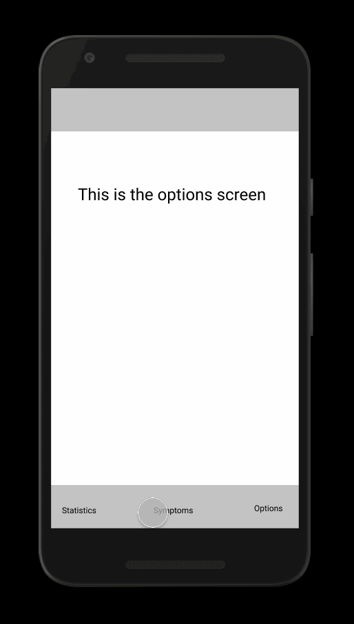

Original App Design Project - README Template
===

# Covid-19 Stats app

## Table of Contents
1. [Overview](#Overview)
1. [Product Spec](#Product-Spec)
1. [Wireframes](#Wireframes)
2. [Schema](#Schema)

## Overview
### Description
The primary function of this app is to collect and display COVID-19 statistics of a given or praticular area. Areas include locations such as city and/or state. 
Area is also limited to locations within the 50 United States. 

### App Evaluation
[Evaluation of your app across the following attributes]
- **Category:** Health and Wellness
- **Mobile:** Phone, tablet
- **Story:** 
- **Market:** 18-99, android, apple
- **Habit:** Frequent(at least once a week)
- **Scope:** Select cities within the United States

## Product Spec

### 1. User Stories (Required and Optional)

**Required Must-have Stories**

* User must be able to register(must choose between an organization or an individual)

* User must be able to log-in

* User must be given an option to change or retreive password

* User must be able to view COVID-19 statistics for their current location/address

* User must be able to put in an address, with zip code

* User must be able to scroll options icon screen

* User must be able to view and edit their data

An individual user:

*Must be able to find nearest testing center or hospital relative to the address they put in

*Must be able to fill out symptom checklist.
 -Depending on results of symptom checklist, user must be given a list of locations ordered by distance from nearest to farthest(between 0-10 miles) 
  of COVID-19 testing locations and hospitals.

An organization user:

*Must be able to display: 
Organization Name
Location
Mainline Phone number
Update the above information through an update button

**Optional Nice-to-have Stories**

* Individual user must be able to view additional information regarding COVID-19, including:
-prevention
-symptoms
-what to do if experiencing symptoms

### 2. Screen Archetypes

* Login 
  * User must be able to log-in
  * User must be given an option to change or retreive password
* Register - User signs up for an account  account
   * User must be able to register(must choose between an organization or an individual)
    
   
* Option Screen - User can see a list of icons here: Statistics, Symptoms checklist, COVID-19 info, User information
  * User must be able to scroll options icon screen
  
* Statistics screen
  * User must be able to view COVID-19 statistics for their current location/address
 
* User information Screen
  * User must be able to view and edit their data
  
* Symptoms checklist screen
    * Must be able to fill out symptom checklist.
    * Depending on results of symptom checklist, user must be given a list of locations ordered by distance from nearest to farthest(between 0-10 miles) of COVID-19 testing locations and hospitals.

* COVID-19 info screen
  * Individual user must be able to view additional information regarding COVID-19, including:
  -prevention
  -symptoms
  -what to do if experiencing symptoms
 

### 3. Navigation

**Tab Navigation** (Tab to Screen)

* Options Screen
* Symptoms checklist
* Statistics

**Flow Navigation** (Screen to Screen)

* Login 
  * Options screen
  
* Register - User signs up for an account  account
  * Options Screen
  
* Option Screen - User can see a list of icons here: Statistics, Symptoms checklist, COVID-19 info, User information
  * Statistics
  * Symptoms checklist
  * Covid-19 info 
  * User information
 
* Statistics screen
  * Statistics information screen
  * Options
 
* User information Screen
  * User settings
  * Options
 
* Symptoms checklist screen
  * Checklist quiz
  * Options
    
* COVID-19 info screen
  * Information screen
  * Options
 
## Wireframes
Picture of hand sketched wireframes: https://imgur.com/a/ShyPNtv
Wireframe interaction: https://www.figma.com/file/d2voIoCu9fT6CyRbGnfYMj/Untitled?node-id=0%3A1

### [BONUS] Digital Wireframes & Mockups

### [BONUS] Interactive Prototype

## Schema 
[This section will be completed in Unit 9]
### Models
[Add table of models]
### Networking
- [Add list of network requests by screen ]
- [Create basic snippets for each Parse network request]
- [OPTIONAL: List endpoints if using existing API such as Yelp]
